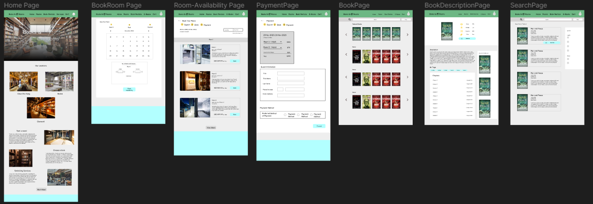
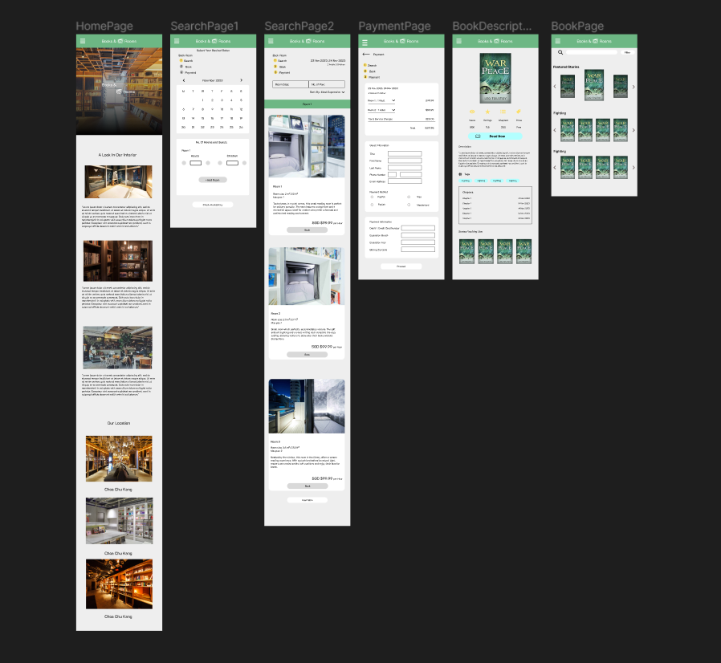

# Books & Rooms

Books & Rooms is a unique bookstore aimed to elevate book readers' experience. Books & Rooms creates an overall immersive experience for book lovers by implementing the concepts of comfortable and pleasant hotel rooms. Visitors are able to rent these rooms, allowing them to indulge in their books in their own space. Books & Rooms also stores variety of books, which caters to unique tastes of each individual. Buying and renting of books physically or through an online website is possible as this offers visitors who prefer different ways of reading.

## Design Process

### Target Audience

This website is designed for individuals such as book enthusiasts, casual readers and those who seek to enhance their reading experience or simply for users to browse through the website in search of their favourite books.

### User Goals:

**1. Book Rooms:**

**Need:** As a visitor, I want to book rooms through the website, so that the room will be available when I visit the book store.
**How the project helps:** The website helps users to book their desired rooms by selecting dates and checking room availability without the need to visit the physical bookstore.

**2. Rent Books:**

**Need:** As a visitor, I want to rent books through the website, so that the books I want to read will be available.
**How the project helps:** The website helps users to look through the various books and buying or renting them online.

**3. Nearest Bookstore:**

**Need:** As a visitor, I want to be able to see the various locations of the bookstore, so that I can identify the nearest one and understand the directions to reach it.
**How the project helps:** The website contains information on the various branch of the bookstores. From the website, users can identify and navigate to the locations.

**4. Book Discounts**

**Need:** As a reader, I want to find books that are on sale in the bookstore online, so that I do not need to buy from the physical bookstore.
**How the project helps:** The website helps users to be notified of the upcoming sales that they are looking for.

**5. Immersive Reading Experience**

**Need:** As a book enthusiast, I want to find a comfortable room to read in, so that I am able to relax while immerse myself in the stories.
**How the project helps:** The website helps users in finding and selecting rooms that are based on their preference to ensure that they can enjoy and indulge themselves in the stories.

Figma Link: https://www.figma.com/file/BGyb1xJWQJIH26P9itL98U/Untitled?type=design&node-id=50%3A2&mode=design&t=Des19ceZabwQeToc-1

## Features

Features Home - This page contains the various locations of the bookstore as well as what services it provides, which allows users to find out where the bookstores are located and whether they will enjoy going there.

Search - This page allows users to book rooms by searching for the availability of the rooms after selecting the dates.

Book - This page allows users to select the rooms that they want to stay in by looking through the various rooms and booking the one that they want to stay in.

Payment - This page allows users to pay for the rooms by entering their own information as well as the payment information.

Books - This page allows users to browse through the list of books so that they are able to rent or buy the physical copy or e-books.

Book details - This page allows users to look through the description and decide if they are willing to buy or rent the book.

### Existing Features

- Home Page

Home Page allows users to find out the locations of the different bookstores and the types of services that are being provided

- Book Room

Book Room Feature allows users to book their desired room in advance by selecting the date on the calendar and pressing 'Check Availability' button.

- Room Availability

Room Availability feature allows users to select the available rooms, by booking the rooms that are being displayed on the website.

- Payment

Payment feature allows users to book the room and pay in advance by entering their personal information.

### Features Left to be Implemented

- Books
  This feature allows users to browse through the list of books so that they are able to rent or buy the physical copy or e-books.

- Book details,
  This feature allows users to look through the description and decide if they are willing to buy or rent the book.

- Cart
  This feature allows users to track what books that they are going to buy (Physical / E-Books).

- Favourite
  This feature allows users to store books that they have favourited in a list.
- Notification
  This feature will remind users of the availability of books which they put in their favourited books list, in case it becomes available.
- Profile
  This feature contains settings, books read, books downloaded, and feedback to provide convenience for users.
- Filter
  This feature helps users to search the rooms and books that they want by selecting the category that they are looking for.

## Technologies Used

- WebKit (https://webkit.org/)
  I used webkit to create an animation footer, providing visual appeal to the website.

## Testing

1. Footer (Subscribe)
   i. Go to the footer (found in every page)
   ii. Try to Enter Email and press the 'Subscribe' button.
   iii. Website will receive the input and store in the storage.

2. Filter Rooms
   i. Go to the "Room Availability" page after selecting one of the dates from "Book Room" page.
   ii. Click on the different categories e.g. Room Size, Room Type, and Sort By.
   iii. A dropdown will appear for each category and display the different values
   e.g. (Small, Medium, Spacious for the different Room Sizes).
   iv. When the users click on one of the value, the page will update and display
   rooms that the users are looking for.

3. Check Room Details
   i. Go to the "Payment" page
   ii. At the top, it will display the rooms that users have selected.
   iii. By clicking the "View Details" Button (not implemented), the website will show
   the full details of the room.

## Credit

### Content

Descriptions generated from:
https://chat-gpt.com/

### Media

Pictures in index.html are taken from [https://www.bookbub.com/blog/sleep-behind-the-shelves-of-book-and-bed-tokyo](https://www.bookbub.com/blog/sleep-behind-the-shelves-of-book-and-bed-tokyo)

Footer:

- https://blogger.googleusercontent.com/img/b/R29vZ2xl/AVvXsEia0PYPxwT5ifToyP3SNZeQWfJEWrUENYA5IXM6sN5vLwAKvaJS1pQVu8mOFFUa_ET4JuHNTFAxKURFerJYHDUWXLXl1vDofYXuij45JZelYOjEFoCOn7E6Vxu0fwV7ACPzArcno1rYuVxGB7JY6G7__e4_KZW4lTYIaHSLVaVLzklZBLZnQw047oq5-Q/s16000/volks.gif
- https://blogger.googleusercontent.com/img/b/R29vZ2xl/AVvXsEigB8iI5tb8WSVBuVUGc9UjjB8O0708X7Fdic_4O1LT4CmLHoiwhanLXiRhe82yw0R7LgACQ2IhZaTY0hhmGi0gYp_Ynb49CVzfmXtYHUVKgXXpWvJ_oYT8cB4vzsnJLe3iCwuzj-w6PeYq_JaHmy_CoGoa6nw0FBo-2xLdOPvsLTh_fmYH2xhkaZ-OGQ/s16000/footer_bg.png
- https://blogger.googleusercontent.com/img/b/R29vZ2xl/AVvXsEhyLGwEUVwPK6Vi8xXMymsc-ZXVwLWyXhogZxbcXQYSY55REw_0D4VTQnsVzCrL7nsyjd0P7RVOI5NKJbQ75koZIalD8mqbMquP20fL3DxsWngKkOLOzoOf9sMuxlbyfkIBTsDw5WFUj-YJiI50yzgVjF8cZPHhEjkOP_PRTQXDHEq8AyWpBiJdN9SfQA/s16000/cyclist.gif

### Inspiration

I received inspiration for this project from:

[https://www.bookbub.com/blog/sleep-behind-the-shelves-of-book-and-bed-tokyo](https://www.bookbub.com/blog/sleep-behind-the-shelves-of-book-and-bed-tokyo)

[https://www.marriott.com/](https://www.marriott.com/)
